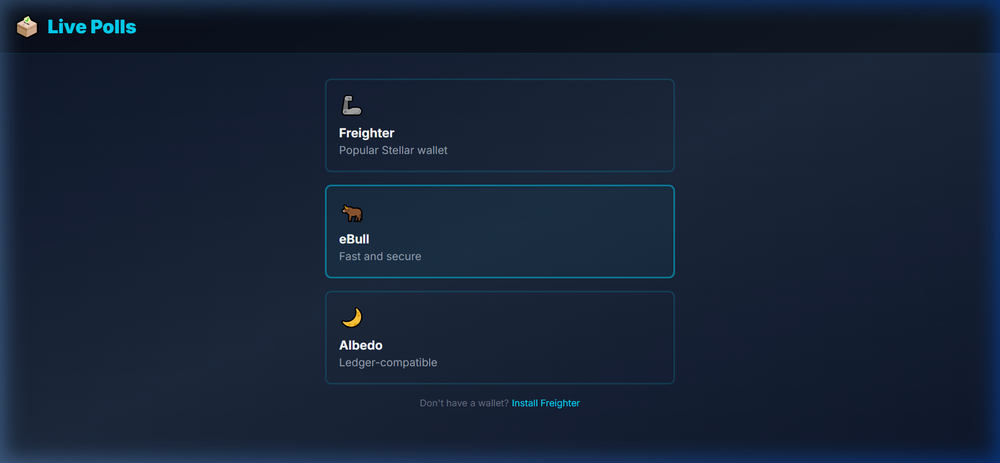
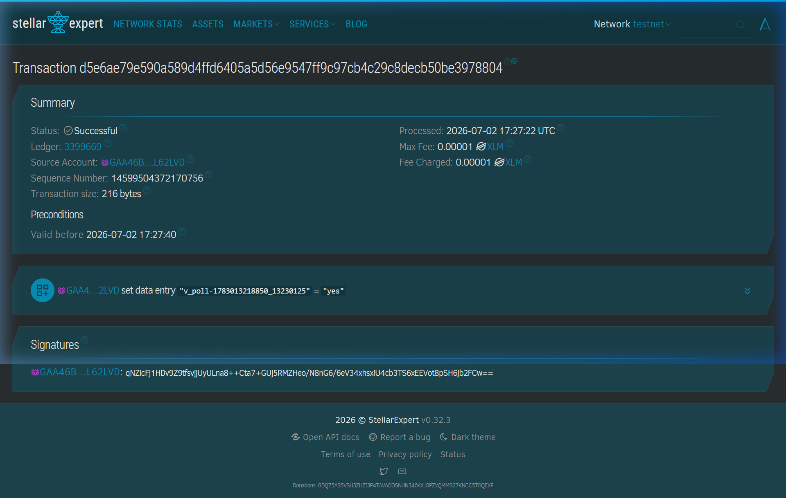
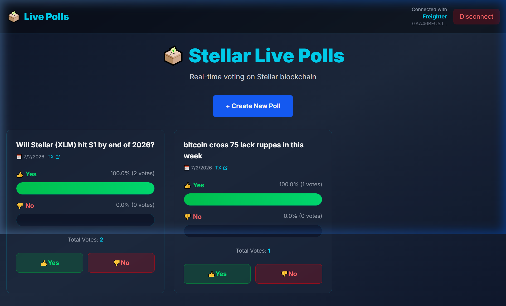

# 🗳️ Stellar Live Polls

> Real-time on-chain voting DApp built on Stellar Soroban Smart Contracts — **Level 2 Yellow Belt Submission**

---

## 🌐 Live Demo

👉 **https://stellar-yellow-belt-6dr7.vercel.app/**

---

## 🎬 Demo Video (1 Min)

👉 **https://www.loom.com/share/9387c8b51906454e94813104f8892b06**

---

## 🟡 Level 2 – Yellow Belt Requirements

| Requirement | Status |
|---|---|
| 3 error types handled | ✅ Done |
| Contract deployed on testnet | ✅ Done |
| Contract called from frontend | ✅ Done |
| Transaction status visible | ✅ Done |
| Minimum 2+ meaningful commits | ✅ Done |

---

## 📋 Deployed Contract Details

**Network:** Stellar Testnet

**Contract Address:**
```
CA4QCBLGGFS55SYUMJTTQ7JGPX4TZIWP4SJ4YUL6PR6GB7LQZEWCR6TC
```

**View on Stellar Lab:**
https://lab.stellar.org/r/testnet/contract/CA4QCBLGGFS55SYUMJTTQ7JGPX4TZIWP4SJ4YUL6PR6GB7LQZEWCR6TC

**Transaction Hash (verifiable on Stellar Explorer):**
```
7ff7b88db5be060fc826d34870dfe55d81ba30931c57dc582f548603501ff10e
```

**View Transaction on Stellar Expert:**
https://stellar.expert/explorer/testnet/tx/7ff7b88db5be060fc826d34870dfe55d81ba30931c57dc582f548603501ff10e

---

## 🖼️ Screenshots

### 💳 Wallet Options Available


### ✅ Transaction Success


### 🗳️ App UI – Voting Interface


---

## 🛡️ Error Handling (3 Types)

| Error Type | How It's Handled |
|---|---|
| Wallet not found / not installed | Shows `WALLET_NOT_FOUND` message, blocks connection |
| Insufficient XLM balance (< 0.5 XLM) | Shows `INSUFFICIENT_BALANCE` error, prevents transaction |
| Transaction rejected / network failure | Shows `TRANSACTION_FAILED` error via toast notification |

---

## 💳 Multi-Wallet Support

- ✅ **Freighter** — fully functional
- 🔜 eBull — coming soon
- 🔜 Albedo — coming soon

---

## 📊 Transaction Status

Every transaction shows real-time status:
- ⏳ **Pending** — transaction submitted, waiting for confirmation
- ✅ **Success** — transaction confirmed on Stellar testnet (with explorer link)
- ❌ **Failed** — error shown with reason

---

## 🛠️ Setup Instructions

```bash
# 1. Clone the repo
git clone https://github.com/yourusername/stellar-live-polls.git
cd stellar-live-polls

# 2. Install dependencies
npm install

# 3. Start the development server
npm run dev
```

**Prerequisites:**
- Node.js 18+
- [Freighter Wallet](https://freighter.app) browser extension
- Testnet account with XLM (get from [Stellar Laboratory](https://laboratory.stellar.org/#account-creator?network=test))

---

## 🏗️ Tech Stack

| Layer | Technology |
|---|---|
| Smart Contract | Rust + Soroban SDK |
| Frontend | React + Vite |
| Wallet | Freighter |
| Network | Stellar Testnet |
| Deployment | Vercel |

---

🌟 Built on Stellar Blockchain — **Level 2 Yellow Belt** 🟡

---

**👤 Author:** Aryan Pawar
